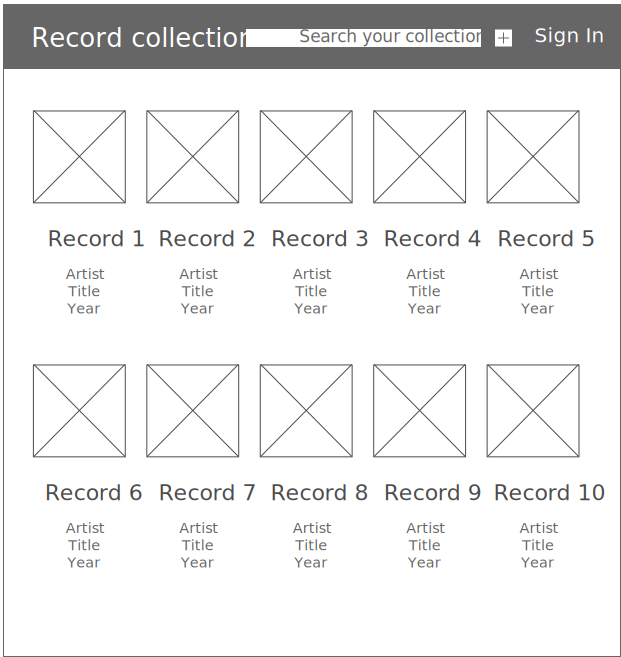
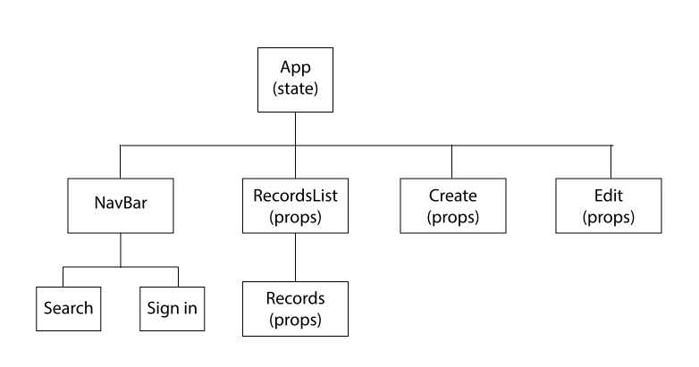

# Record Collection

## Project Description

Record Collection is an app for cataloging and organizing your record collection. Users can input albums into the database and fill out their information.

 information like artist, title, tracklist amongst other related fields.

Once the records are in the database, the user can search and retrieve them and their information in an intuitive, easy to use interface.

The app will be built using Django with REST Framework and PostgreSQL for the backend and React for the frontend.

 

[Here's a link to the Trello board that tracks the project.](https://trello.com/b/XyPSisRn) 
[Here's a link to the Record Collection backend repo.](https://github.com/chavierto/record-collection-backend)

 

## Wireframes

 
 

## User Stories

### _MVP User Stories_

- _As a user, I want to be able to sign-in to the app so that I can have a personalized inventory of my record collection._

- _As a user, I want to be able to see a list of all the records in my collection._

- _As a user, I want to be able to click on a record if it interests me so that I can read all the information about the record._

- _As a user, I want to be able add records to my collection, and to fill out the information for the album: artist, album title, release year, acquired date, genre, label and the tracklist._

- _As a user, I want to be able to see the cover of my records._

### _Post MVP Silver Goals_

- _As a user, I want to be able to search for a record._

- _As a user, I want to be able to sort the current view or search results by different values._

### _Post MVP Gold Goals_

- _As a user, I want to be able to populate my fields from the Discogs API so that I don't have to fill out all the information manually._

- _As a user, I want to be able to have a favorites list where I can have all the records I've marked as favorite._

 

## Frontend

The frontend will be built with HTML, CSS and React for the user interface and component structure, and Axios for making the API calls. It will be deployed to Heroku.

 

 

## Backend

The backend will be built with Django and deployed to Heroku. It will use the Django REST Framework to interact with the React frontend.
